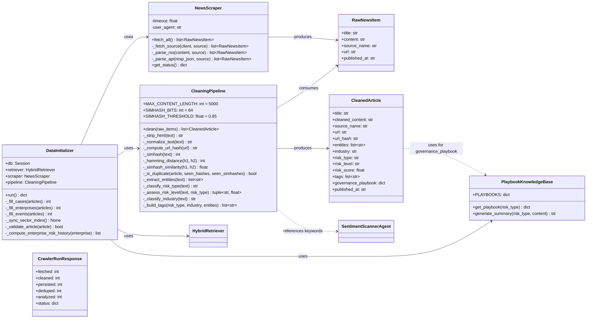
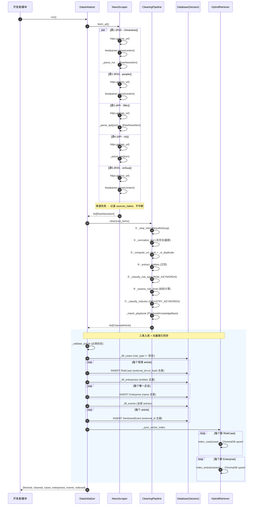
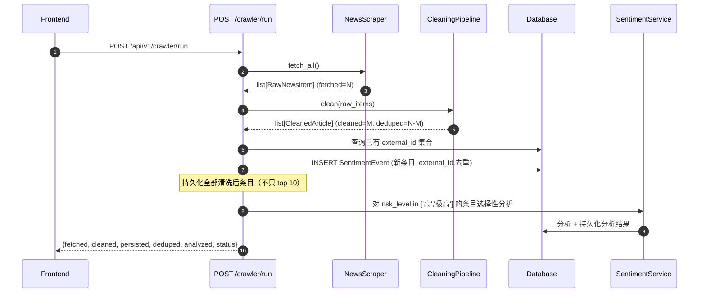
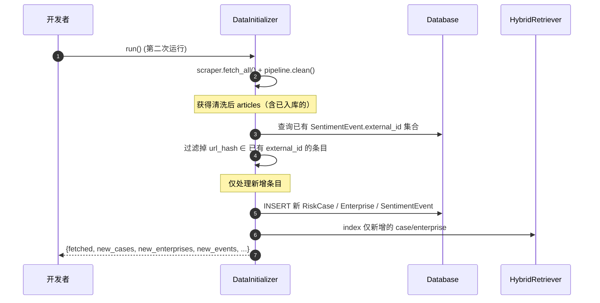
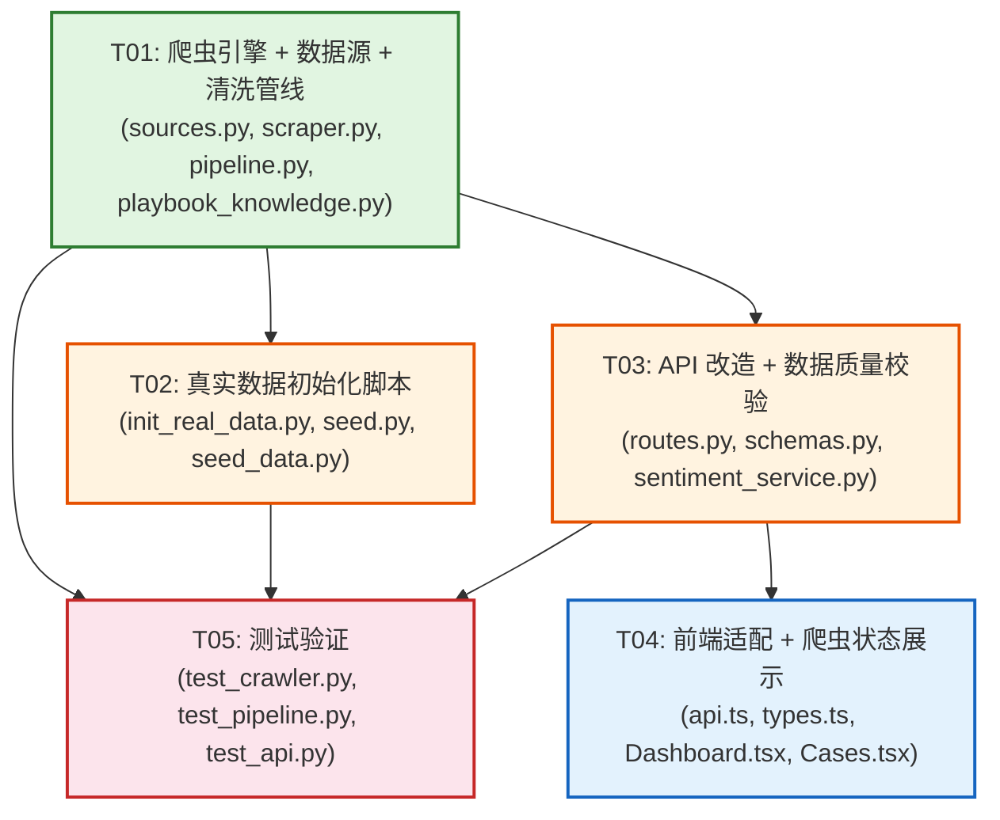

# 系统架构设计 — CPublic Sentiment 舆情系统全面优化

> 架构师：高见远（Gao） | 对应 PRD: `prd-cpublic-optimization.md`

---

## Part A: 系统设计

### 1. 实现方案

#### 1.1 核心技术挑战分析

| 挑战 | 难点 | 解决策略 |
|------|------|----------|
| **多源并发采集 + 单源失败隔离** | 不同 RSS/API 源结构各异，单源超时/404 不应阻塞整体采集 | `httpx.AsyncClient` + per-source try/except + 结构化状态记录；单源采集超时默认 15s |
| **RSS 解析替代猜测式 JSON** | 当前 `_parse_json_api` 靠猜测字段名（`result.data` / `data.roll_data`），脆弱且不可靠 | 使用 `feedparser` 标准化解析 RSS/Atom feed，提取 `title/summary/link/published_parsed` |
| **数据清洗管线模块化** | 7 步清洗需可独立测试、可组合 | 管线类 `CleaningPipeline` 将每步封装为私有方法，`clean()` 为编排入口；每步纯函数式（输入→输出，无副作用） |
| **增量去重** | 可重复运行不产生重复入库 | 双重去重：① URL hash（`hashlib.md5`）精确去重 ② 标题 SimHash 相似度（阈值 0.85）近似去重；入库时 `external_id = url_hash` 唯一约束 |
| **风险等级自动评估（无 LLM）** | 不依赖 LLM 做风险分级，需纯规则 | 复用 `scanner.py` 的 `RISK_KEYWORDS`/`HIGH_CONFIDENCE_KEYWORDS`/`NEGATIVE_KEYWORDS` 词典，基于关键词命中数加权计算 risk_score → 映射 risk_level |
| **真实数据一次性初始化** | 采集→清洗→入库→向量索引需一条命令完成 | `DataInitializer` 编排类 + 独立脚本 `python -m app.data.init_real_data` |
| **向后兼容（不修改表结构）** | 现有三张表已有数据，不能加列 | 仅修改数据填充逻辑，使用 `external_id`（已有列）做增量去重；`generator.py` 保留不删 |
| **API 改造（持久化原始数据）** | 当前 `/crawler/run` 只分析 top 10 且不持久化 | 改造为：采集→清洗→持久化 SentimentEvent（带 external_id 去重）→选择性分析；返回采集数/清洗数/入库数/去重数 |

#### 1.2 框架与库选型

| 库 | 用途 | 是否已有 | 理由 |
|----|------|----------|------|
| `feedparser` | RSS/Atom feed 解析 | ✅ 已有 (requirements.txt L33) | Python RSS 解析事实标准，替代脆弱的手写 JSON 猜测 |
| `beautifulsoup4` | HTML 标签去除 | ✅ 已有 (L32) | 清洗管线第 1 步，去除 content 中的 HTML 标签 |
| `httpx` | 异步 HTTP 采集 | ✅ 已有 (L21) | 已用于现有 scraper，支持 async + follow_redirects |
| `hashlib` | URL hash / SimHash | ✅ 标准库 | 无需新依赖，`md5`/`sha256` 足够 |
| `re` | 实体提取正则 | ✅ 标准库 | scanner.py 已有企业名正则模式可复用 |
| `sqlalchemy` | ORM 持久化 | ✅ 已有 (L7) | 现有 Base/Session 机制复用 |
| `chromadb` + `sentence-transformers` | 向量索引 | ✅ 已有 (L13-14) | HybridRetriever 已有 `index_case/index_enterprise` 方法 |

**结论：无需新增任何第三方依赖，全部使用 `requirements.txt` 已有库 + Python 标准库。**

#### 1.3 架构模式

采用**分层管道-过滤器（Pipeline-Filter）模式** + **编排器（Orchestrator）模式**：

```
数据源层          爬虫层              清洗管线层              持久化层              向量索引层
┌──────────┐   ┌──────────────┐   ┌──────────────┐   ┌──────────────┐   ┌──────────────┐
│ sources  │──▶│  NewsScraper │──▶│ Pipeline     │──▶│ DataInitializer│──▶│HybridRetriever│
│ .py      │   │  (并发采集)   │   │ (7步清洗)     │   │ (三表入库)    │   │ (index_case等)│
└──────────┘   └──────────────┘   └──────────────┘   └──────────────┘   └──────────────┘
```

- **sources.py**：纯数据配置（静态列表），不含逻辑
- **scraper.py**：采集层，多源并发 + 单源隔离
- **pipeline.py**：清洗层，7 步模块化处理，每步可独立测试
- **init_real_data.py**：编排层，串联采集→清洗→入库→向量索引
- **playbook_knowledge.py**：治理知识库，基于 risk_type 匹配真实治理方案

---

### 2. 文件列表

#### 2.1 新建文件

| 文件路径 | 说明 |
|----------|------|
| `backend/app/crawler/pipeline.py` | 数据清洗管线（7 步：HTML去标签→文本规范化→去重→实体提取→风险分类→风险等级→行业归类） |
| `backend/app/data/init_real_data.py` | 真实数据初始化编排脚本（采集→清洗→三表入库→向量索引） |
| `backend/app/data/playbook_knowledge.py` | 治理方案知识库（基于 risk_type 的真实 playbook，替代模板填空） |
| `backend/tests/test_crawler.py` | 爬虫 + 清洗管线测试（多源隔离、去重、风险分类、实体提取） |
| `backend/tests/test_pipeline.py` | 清洗管线单元测试（每步独立测试） |

#### 2.2 修改文件

| 文件路径 | 修改内容 |
|----------|----------|
| `backend/app/crawler/sources.py` | **重写**：3→5 个真实 RSS/API 端点，明确 `type`/`parser`，移除首页 URL |
| `backend/app/crawler/scraper.py` | **重写**：feedparser 解析 RSS，httpx 解析 API，并发采集 + 单源隔离，返回 `RawNewsItem` |
| `backend/app/data/seed.py` | **小改**：添加 `init_real_data` 函数引用，保留现有 `seed_database` 作为 fallback |
| `backend/app/api/routes.py` | **修改**：`/crawler/run` 改为采集→清洗→持久化→选择性分析；增加空数据友好响应 |
| `backend/app/api/schemas.py` | **新增**：`CrawlerRunResponse` 响应模型（fetched/cleaned/persisted/deduped/analyzed） |
| `backend/scripts/seed_data.py` | **修改**：支持命令行参数 `--real` 调用真实数据初始化 |
| `frontend/src/api.ts` | **修改**：`runCrawler` 返回类型适配新字段；新增 `getCrawlerSources` |
| `frontend/src/types.ts` | **修改**：`CrawlerStatus` 扩展字段；新增 `CrawlerRunResult` 类型 |
| `frontend/src/pages/Dashboard.tsx` | **修改**：增加数据源状态卡片；事件列表增加「来源」列 |
| `frontend/src/pages/Cases.tsx` | **修改**：搜索支持全文检索（title + summary） |
| `backend/tests/test_api.py` | **修改**：新增爬虫 API 集成测试 |

#### 2.3 不修改的文件（明确标注向后兼容）

| 文件路径 | 理由 |
|----------|------|
| `backend/app/models/case.py` | RiskCase 表结构不变 |
| `backend/app/models/enterprise.py` | Enterprise 表结构不变（`external_id` 已在 SentimentEvent 中） |
| `backend/app/models/sentiment.py` | SentimentEvent 表结构不变（`external_id` 列已存在） |
| `backend/app/data/generator.py` | 保留作为测试 fallback，不在初始化中使用 |
| `backend/app/agents/scanner.py` | 词典复用，逻辑不改（清洗管线引用其类属性） |
| `backend/app/rag/retriever.py` | `index_case/index_enterprise` 方法已有，直接调用 |
| `backend/app/main.py` | 不改 |
| `backend/app/config.py` | 不改（已有 `database_url`/`vector_db_path` 等配置） |

---

### 3. 数据结构和接口



#### 3.1 核心数据结构定义

**RawNewsItem**（爬虫采集原始数据，统一格式）:
```python
@dataclass
class RawNewsItem:
    title: str              # 新闻标题
    content: str            # 原始内容（可能含 HTML）
    source_name: str        # 数据源标识（如 "chinanews_rss"）
    url: str                # 新闻链接
    published_at: str      # 发布时间（ISO 字符串）
```

**CleanedArticle**（清洗后结构化数据，映射到三表）:
```python
@dataclass
class CleanedArticle:
    title: str              # 清洗后标题
    cleaned_content: str    # 清洗后正文（≤5000字符，无HTML标签）
    source_name: str        # 数据源名称
    url: str                # 原始 URL
    url_hash: str           # URL MD5 hash（用于 external_id 去重）
    entities: list[str]     # 提取的企业/机构实体列表
    industry: str           # 行业归类
    risk_type: str          # 风险类型分类
    risk_level: str         # 风险等级（低/中/高/极高）
    risk_score: float       # 风险评分（0.0-1.0）
    tags: list[str]         # 标签列表
    governance_playbook: dict  # 治理方案
    published_at: str       # 发布时间
```

#### 3.2 关键方法签名

**NewsScraper.fetch_all()**:
```python
async def fetch_all(self) -> list[RawNewsItem]:
    """并发采集所有数据源，单源失败隔离。
    遍历 SOURCES，对每个源调用 _fetch_source，
    try/except 包裹单源采集，失败记录到 sources_failed 不中断。
    返回所有成功源的 RawNewsItem 列表。
    """
```

**CleaningPipeline.clean()**:
```python
def clean(self, raw_items: list[RawNewsItem]) -> list[CleanedArticle]:
    """执行 7 步清洗管线：
    1. _strip_html — BeautifulSoup 去除 HTML 标签
    2. _normalize_text — 去空白/统一编码/截断 ≤5000 字符
    3. _compute_url_hash + _is_duplicate — URL hash + SimHash 去重
    4. _extract_entities — 正则匹配企业名
    5. _classify_risk_type — 基于 RISK_KEYWORDS 词典匹配
    6. _assess_risk_level — 基于 HIGH_CONFIDENCE/NEGATIVE 关键词加权
    7. _classify_industry — 基于 INDUSTRY_KEYWORDS 词典匹配
    返回去重后的 CleanedArticle 列表。
    """
```

**DataInitializer.run()**:
```python
def run(self) -> dict:
    """一次性编排：采集→清洗→三表入库→向量索引同步。
    1. scraper.fetch_all() 获取原始数据
    2. pipeline.clean() 清洗
    3. _fill_cases — 筛选 risk_type != '其他' 的条目 → RiskCase
    4. _fill_enterprises — 从 entities 提取企业 → Enterprise
    5. _fill_events — 全部清洗后条目 → SentimentEvent（external_id 去重）
    6. _sync_vector_index — 调用 retriever.index_case/index_enterprise
    返回 {fetched, cleaned, cases, enterprises, events, indexed}
    """
```

**SimHash 去重核心算法**:
```python
def _simhash(self, text: str) -> int:
    """计算 64-bit SimHash 值。
    1. 分词：中文按 2-gram 切分
    2. 每个 token 用 hashlib.md5 hash → 64bit 整数
    3. 64 维向量累加：hash 第 i 位为 1 → +1，为 0 → -1
    4. 最终 >0 的位取 1，否则取 0
    """

def _simhash_similarity(self, h1: int, h2: int) -> float:
    """两个 SimHash 的相似度 = 1 - Hamming距离 / 64"""
    return 1 - bin(h1 ^ h2).count('1') / 64
```

**风险等级评估算法**:
```python
def _assess_risk_level(self, text: str, risk_type: str) -> tuple[str, float]:
    """基于关键词权重计算 risk_score → 映射 risk_level。
    - risk_type 命中权重：+0.3
    - NEGATIVE_KEYWORDS 每命中一个：+0.05（上限 0.3）
    - HIGH_CONFIDENCE_KEYWORDS 每命中一个：+0.1（上限 0.3）
    - 基础分 0.2
    映射：score < 0.4 → 低, 0.4-0.6 → 中, 0.6-0.8 → 高, ≥0.8 → 极高
    """
```

---

### 4. 程序调用流程

#### 4.1 真实数据初始化流程（核心时序图）



#### 4.2 爬虫 API 改造后调用流程



#### 4.3 增量更新流程（重复运行）



---

### 5. 待明确事项

| # | 事项 | 当前假设 | 影响范围 |
|---|------|----------|----------|
| 1 | **RSS/API 端点实际可达性**：PRD 列出的 5 个数据源 URL 需在实现阶段验证 | 架构设计已预留多源扩展和单源失败隔离，单源不可用不影响整体 | `sources.py` |
| 2 | **36氪/财联社 API 格式**：需验证 JSON 响应结构 | `_parse_api` 设计为可配置字段映射，预留 `fields_map` 参数应对不同 API 格式 | `scraper.py` |
| 3 | **SQLite 并发写入**：`init_real_data` 和 `/crawler/run` 同时运行时 SQLite 写锁冲突 | 开发环境建议不同时运行；生产环境用 MySQL | `init_real_data.py`, `routes.py` |
| 4 | **首次数据量是否达标**：PRD 要求 ≥100 案例 / ≥30 企业 / ≥50 事件，单次采集可能不足 | 设计支持多次运行累积；`init_real_data` 可重复执行增量补充 | `init_real_data.py` |
| 5 | **SimHash 64-bit 精度**：短标题（<20字）SimHash 可能区分度不足 | 补充 URL hash 精确去重作为第一道；SimHash 仅做标题近似去重 | `pipeline.py` |
| 6 | **企业实体提取准确率**：正则匹配 "XX公司/集团/科技" 可能误匹配非企业文本 | 管线中增加最低长度（≥3字符）+ 后缀列表过滤；后续可用 LLM 优化 | `pipeline.py` |

---

## Part B: 任务分解

### 6. 依赖包列表

**无需新增任何第三方包。** 全部使用 `requirements.txt` 中已有依赖：

| 包 | 版本要求 | 用途 |
|----|----------|------|
| `feedparser` | `>=6.0.0` (已有 L33) | RSS/Atom feed 解析，替代猜测式 JSON 解析 |
| `beautifulsoup4` | `>=4.12.0` (已有 L32) | HTML 标签去除（清洗管线第 1 步） |
| `httpx` | `>=0.27.0` (已有 L21) | 异步 HTTP 采集（已用于现有 scraper） |
| `hashlib` | 标准库 | URL MD5 hash + SimHash 计算 |
| `re` | 标准库 | 企业实体正则提取 |
| `sqlalchemy` | `>=2.0.30` (已有 L7) | ORM 持久化 |
| `chromadb` | `>=0.5.0` (已有 L13) | 向量索引（已有 HybridRetriever） |
| `sentence-transformers` | `>=3.0.0` (已有 L14) | Embedding 模型（已有） |

> PRD 约束：「优先使用 requirements.txt 中已有的库，不引入新的重型依赖」——本设计完全满足。

---

### 7. 任务列表（按依赖顺序排列）

#### T01: 爬虫引擎 + 数据源配置 + 清洗管线

| 字段 | 内容 |
|------|------|
| **Task ID** | T01 |
| **Task Name** | 爬虫引擎重写 + 数据源配置 + 数据清洗管线 |
| **Source Files** | `backend/app/crawler/sources.py`(改), `backend/app/crawler/scraper.py`(改), `backend/app/crawler/pipeline.py`(新建), `backend/app/data/playbook_knowledge.py`(新建) |
| **Dependencies** | 无 |
| **Priority** | P0 |
| **描述** | ① 重写 `sources.py`：配置 5 个真实 RSS/API 端点（中国新闻网、人民网、新华网 RSS + 36氪、财联社 API），每个源含 `name/type/url/parser/fields_map`；② 重写 `scraper.py`：使用 `feedparser` 解析 RSS、`httpx` 解析 API，并发采集 + 单源 try/except 隔离，返回 `RawNewsItem` 列表；③ 新建 `pipeline.py`：实现 7 步清洗管线（HTML去标签→文本规范化→URL hash + SimHash 去重→实体提取→风险分类→风险等级评估→行业归类），复用 `scanner.py` 的 `RISK_KEYWORDS`/`INDUSTRY_KEYWORDS` 等词典；④ 新建 `playbook_knowledge.py`：基于 `risk_type` 的真实治理方案知识库（非模板填空），提供 `get_playbook(risk_type)` 和 `generate_summary(risk_type, content)` 方法。 |
| **验收标准** | `sources.py` 有 5 个源且 URL 非首页；`scraper.py` 使用 `feedparser`；`pipeline.py` 7 步每步可独立调用；单源失败不阻塞其他源 |

#### T02: 真实数据初始化编排脚本

| 字段 | 内容 |
|------|------|
| **Task ID** | T02 |
| **Task Name** | 真实数据初始化脚本（采集→清洗→入库→向量索引） |
| **Source Files** | `backend/app/data/init_real_data.py`(新建), `backend/app/data/seed.py`(改), `backend/scripts/seed_data.py`(改) |
| **Dependencies** | T01 |
| **Priority** | P0 |
| **描述** | ① 新建 `init_real_data.py`：实现 `DataInitializer` 编排类，`run()` 方法串联 `NewsScraper.fetch_all()` → `CleaningPipeline.clean()` → 三表入库（`_fill_cases` 筛选 risk_type≠'其他'、`_fill_enterprises` 从 entities 去重、`_fill_events` 全部条目用 `external_id` 去重）→ `_sync_vector_index` 调用 `HybridRetriever.index_case/index_enterprise`；② 修改 `seed.py`：新增 `init_real_data(db)` 函数引用 `DataInitializer`，保留 `seed_database` 作为 fallback；③ 修改 `seed_data.py`：支持 `python scripts/seed_data.py --real` 调用真实数据初始化。 |
| **验收标准** | `python -m app.data.init_real_data` 一键完成采集→清洗→入库→向量索引；重复运行不产生重复数据（external_id 去重）；至少填充 ≥100 案例 / ≥30 企业 / ≥50 事件 |

#### T03: API 改造 + 数据质量校验

| 字段 | 内容 |
|------|------|
| **Task ID** | T03 |
| **Task Name** | 爬虫 API 改造 + 错误处理增强 + 数据质量校验 |
| **Source Files** | `backend/app/api/routes.py`(改), `backend/app/api/schemas.py`(改), `backend/app/services/sentiment_service.py`(改) |
| **Dependencies** | T01 |
| **Priority** | P0/P1 |
| **描述** | ① 改造 `routes.py` 的 `/crawler/run`：先采集→清洗→持久化全部清洗后条目到 `SentimentEvent`（external_id 去重）→选择性分析高/极高风险条目；返回 `{fetched, cleaned, persisted, deduped, analyzed, status}`；② 新增 `schemas.py` 的 `CrawlerRunResponse` 模型；③ 所有列表 API 增加空数据友好响应（非 500）；`/cases` 搜索改为全文检索（`title.or(summary).contains(search)`）；④ `sentiment_service.py` 增加空数据库时的 fallback 处理；⑤ 入库前数据质量校验（title/content/source 非空，risk_level 枚举合法）。 |
| **验收标准** | `/crawler/run` 持久化全部数据而非只分析 top 10；空数据库时 API 返回空列表非 500；数据质量校验不合格条目跳过并记录日志 |

#### T04: 前端适配 + 爬虫状态展示

| 字段 | 内容 |
|------|------|
| **Task ID** | T04 |
| **Task Name** | 前端数据适配 + 爬虫状态面板 + 搜索增强 |
| **Source Files** | `frontend/src/api.ts`(改), `frontend/src/types.ts`(改), `frontend/src/pages/Dashboard.tsx`(改), `frontend/src/pages/Cases.tsx`(改) |
| **Dependencies** | T03 |
| **Priority** | P1/P2 |
| **描述** | ① `types.ts`：新增 `CrawlerRunResult` 类型（fetched/cleaned/persisted/deduped/analyzed），扩展 `CrawlerStatus` 增加 `sources_detail` 字段；② `api.ts`：`runCrawler` 返回类型适配新字段；③ `Dashboard.tsx`：新增「数据源状态」卡片（最近运行时间、各源采集数、成功/失败列表）；事件列表增加「来源」列展示 source 字段；④ `Cases.tsx`：搜索支持全文检索（title + summary）；⑤ 各页面增加空状态引导（"暂无数据，请运行爬虫采集"）+ 加载骨架屏。 |
| **验收标准** | Dashboard 展示爬虫运行状态和各源采集数；案例搜索支持全文检索；无数据时展示引导性空状态 |

#### T05: 测试验证

| 字段 | 内容 |
|------|------|
| **Task ID** | T05 |
| **Task Name** | 爬虫测试 + 清洗管线测试 + API 回归测试 |
| **Source Files** | `backend/tests/test_crawler.py`(新建), `backend/tests/test_pipeline.py`(新建), `backend/tests/test_api.py`(改) |
| **Dependencies** | T01, T02, T03 |
| **Priority** | P0 |
| **描述** | ① `test_crawler.py`：测试单源失败隔离（mock httpx 超时）、RSS 解析正确性（mock feedparser 输入）、多源并发采集；② `test_pipeline.py`：7 步清洗每步独立测试——HTML 去标签（含 `<script>` 边界）、文本规范化（超长截断）、URL hash + SimHash 去重（含近似标题）、实体提取（含误匹配过滤）、风险分类（覆盖 9 种 risk_type）、风险等级评估（边界值）、行业归类；③ `test_api.py`：新增 `/crawler/run` 集成测试（mock scraper 返回固定数据）、空数据库全 API 友好响应测试、`/cases` 全文搜索测试。 |
| **验收标准** | 所有测试通过；`pytest -q` 无失败；清洗管线每步有独立测试用例；爬虫单源失败隔离有验证 |

---

### 8. 共享知识（跨文件约定）

#### 8.1 数据格式约定

- **RawNewsItem 统一格式**：所有数据源（RSS/API）采集后统一为 `{title, content, source_name, url, published_at}` 字典，`source_name` 使用 `sources.py` 中的 `name` 字段（如 `"chinanews_rss"`）
- **CleanedArticle 统一格式**：清洗后统一为含 `url_hash`/`entities`/`risk_type`/`risk_level`/`risk_score`/`industry`/`governance_playbook` 的结构
- **url_hash 计算**：`hashlib.md5(url.encode()).hexdigest()`，用于 `SentimentEvent.external_id` 去重
- **SimHash 位宽**：64-bit，`hashlib.md5` 取前 8 字节转 int
- **文本截断**：`cleaned_content` 最大 5000 字符（PRD 规定）

#### 8.2 风险等级映射约定

| risk_score 范围 | risk_level | 说明 |
|-----------------|------------|------|
| 0.0 – 0.4 | 低 | 无风险关键词命中或仅正面词 |
| 0.4 – 0.6 | 中 | 命中 1-2 个风险关键词 |
| 0.6 – 0.8 | 高 | 命中多个风险关键词 + 负面词 |
| 0.8 – 1.0 | 极高 | 命中 HIGH_CONFIDENCE 关键词（监管/处罚/立案等） |

#### 8.3 关键词词典复用约定

- `CleaningPipeline` 直接引用 `SentimentScannerAgent` 的类属性：
  - `SentimentScannerAgent.RISK_KEYWORDS` — 9 种风险类型关键词词典
  - `SentimentScannerAgent.HIGH_CONFIDENCE_KEYWORDS` — 高危信号词
  - `SentimentScannerAgent.NEGATIVE_KEYWORDS` — 负面关键词
  - `SentimentScannerAgent.INDUSTRY_KEYWORDS` — 10 个行业关键词词典
- **不复制词典到 pipeline.py**，直接 `from app.agents.scanner import SentimentScannerAgent` 引用类属性

#### 8.4 数据库操作约定

- **增量去重**：所有 `SentimentEvent` 入库前先查询 `existing_external_ids = {e.external_id for e in db.query(SentimentEvent.external_id).all()}`，跳过已存在的
- **企业去重**：`Enterprise` 按 `name` 去重，先查已有企业名集合
- **案例去重**：`RiskCase` 按 `title + source_url` 组合去重
- **向量索引**：仅对新增的 RiskCase/Enterprise 调用 `retriever.index_case/index_enterprise`，避免重复索引
- **DB Session**：初始化脚本使用独立 Session（`SessionLocal()`），API 使用 `Depends(get_db)` 注入

#### 8.5 API 响应约定

- **爬虫 API 响应**：`{fetched: int, cleaned: int, persisted: int, deduped: int, analyzed: int, status: dict}`
  - `fetched` = 采集到的原始条目数
  - `cleaned` = 清洗后条目数
  - `persisted` = 实际入库条目数
  - `deduped` = 被去重跳过的条目数
  - `analyzed` = 选择性分析的条目数
- **空数据响应**：所有列表 API 在无数据时返回 `{total: 0, items: []}`（HTTP 200），不返回 500

#### 8.6 错误处理约定

- **单源失败隔离**：`_fetch_source` 包裹 try/except，失败记入 `sources_failed` 列表，不中断其他源
- **清洗失败处理**：单条 article 清洗失败跳过，记录 `logger.warning`，不中断管线
- **入库质量校验**：`_validate_article` 校验 title/content/source 非空、risk_level ∈ {低,中,高,极高}，不合格跳过并记录

#### 8.7 命名约定

- 数据源 `name`：snake_case，如 `chinanews_rss`、`36kr_api`、`cls_api`
- `source_name` 作为 `SentimentEvent.source` 字段值存储
- URL hash 作为 `SentimentEvent.external_id` 存储
- `generator.py` 保留不删，仅用于 `tests/` 中的测试 fixture

---

### 9. 任务依赖图



**依赖说明**：
- **T01 → T02, T03**：初始化脚本和 API 改造都依赖爬虫引擎和清洗管线
- **T03 → T04**：前端适配依赖 API 改造完成（新响应格式）
- **T01, T02, T03 → T05**：测试覆盖所有代码变更
- **T02 和 T03 无互相依赖**：可并行开发（两者都仅依赖 T01）
